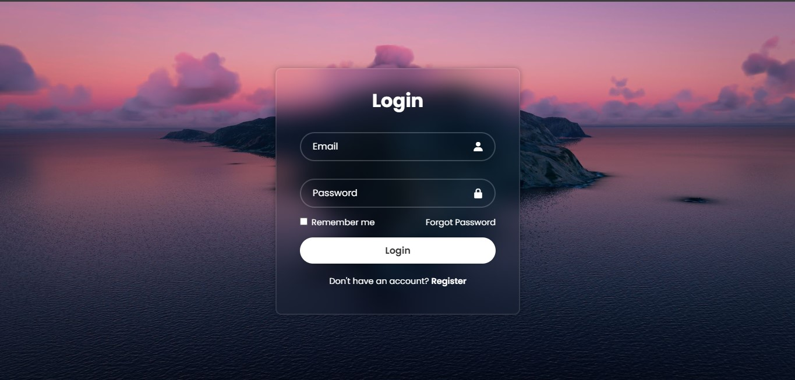

<!-- 
================================================================================================================
Name        : Blurry login page 2
Source      : Re-code [https://www.youtube.com/watch?v=hlwlM4a5rxg]
Recode by   : Algorithm Dev
Telegram    : https://t.me/algorithmIDN 
Version     : v1 
================================================================================================================
-->

  

<h1 align="center">Blurry Login 2</h1>

<b>Version 1.0</b>

    
    
    <h3>
        Modern Blurry Login pages 2 - Blurry login pages are a modern login page that combines a blurry display on the login card.
    </h3>

## Feature

- Blur login page

## Download

Download [Github](https://github.com/mahisataruna/blur-login-2) & [Mediafire](https://sfl.gl/Y9PSpKC0).

 

  
  
   
  AlgorithmIDN © 2024

